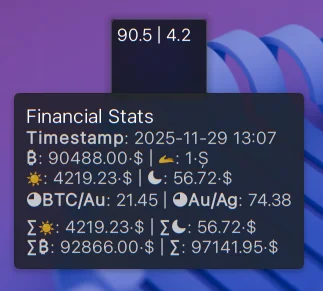
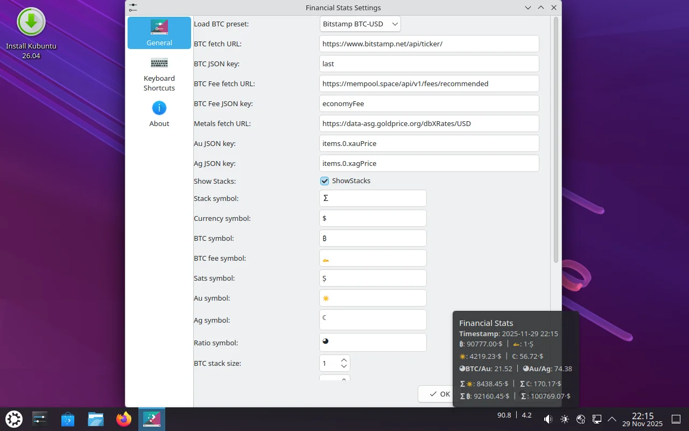

# Financial Stats

[](https://opensource.org/licenses/)


## Description

KDE Plasma widget that displays financial stats.
Currently it displays Bitcoin (BTC), Gold (Au), Silver (Ag) and ratios between them.
Optionally it can display value of user's stack after taxes.


URLs and stack values are configurable.


## Goal

The widget is intented to provide quick glance values (panel widget) and detailed stats (using hover-on pop-up text) of major Financial Items like Bitcoin, Gold and Silver.

## Installing/Updating

### From shell:
* Update
```
wget https://github.com/eugenesan/finstats/releases/latest/download/finstats.plasmoid -O ${TMPDIR:-/tmp}/finstats.plasmoid && kpackagetool6 -t Plasma/Applet -u ${TMPDIR:-/tmp}/finstat.plasmoid && systemctl --user restart plasma-plasmashell.service
```

* Install
```
wget https://github.com/eugenesan/finstats/releases/latest/download/finstats.plasmoid -O ${TMPDIR:-/tmp}/finstats.plasmoid && kpackagetool6 -t Plasma/Applet -i ${TMPDIR:-/tmp}/finstat.plasmoid && systemctl --user restart plasma-plasmashell.service
```

### Manual with Plasma UI:
* Install via "Add Widgets..." -> "Get New Widgets..." -> "Download..."
* Install from [KDE Store](https://store.kde.org/p/2331320)
* Download Latest \*.plasmoid from [Releases page](https://github.com/eugenesan/finstats/releases) and install it via "Add Widgets..." -> "Get New Widgets..." -> "Install Widget From Local file"

## In cases of panel freezes or crashes 🆘

There is a chance that the widget will be incompatible with your OS distribution. In such cases you can use the following script to downgrade the panel version:
```
wget https://github.com/eugenesan/finstats/releases/download/v0.6.8/finstat.plasmoid -O ${TMPDIR:-/tmp}/finstat.plasmoid && kpackagetool6 -t Plasma/Applet -u ${TMPDIR:-/tmp}/finstat.plasmoid && systemctl --user restart plasma-plasmashell.service
```

Or you can remove the widget:
```
kpackagetool6 --type Plasma/Applet --remove com.github.eugenesan.finstat
```

Please, don't forget to fill the report about the issues.

## Debugging

### Links:
* https://develop.kde.org/docs/plasma/widget/properties/
* https://develop.kde.org/docs/features/configuration/porting_kf6/
* https://develop.kde.org/docs/plasma/widget/testing/

### Useful shell commands:
```
$ systemctl --user restart plasma-plasmashell
$ plasmoidviewer --applet com.github.eugenesan.finstats
$ plasmawindowed com.github.eugenesan.finstats
$ plasmapkg2 -i .
$ export QML_XHR_DUMP=1
```

## License

This project is licensed under the GPL-3.0-or-later License - see the [LICENSE](https://github.com/eugenesan/finstats/blob/main/LICENSE) file for details

## Contributions

Pull requests and Issue reports are always welcome.

## Acknowledgments

* [antroids](https://github.com/antroids) for providing a template for this applet [application-title-bar](https://github.com/antroids/application-title-bar)

* [spmdrd](https://github.com/spmdrd) for providing inspiration  for this applet [plasma-applet-cryptocurrency-price](https://github.com/spmdrd/plasma-applet-cryptocurrency-price)
